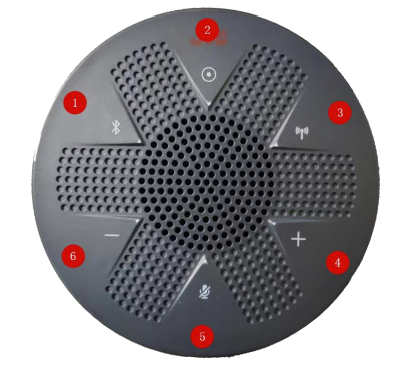
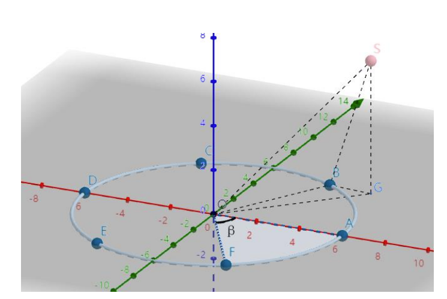
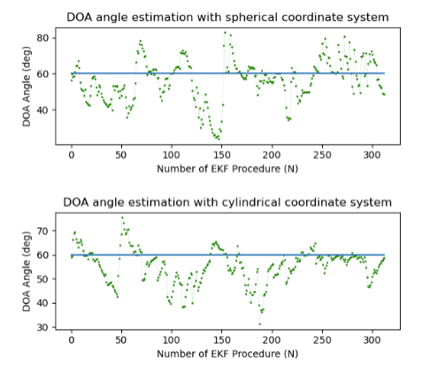
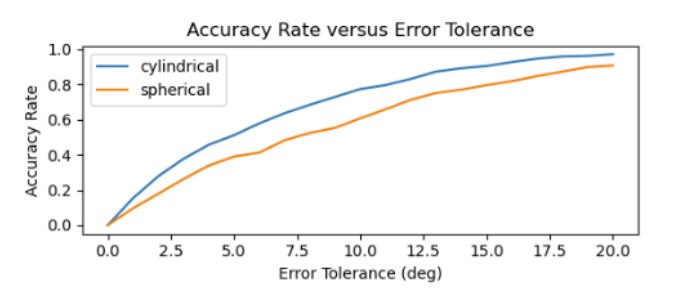

# SoundLocalization-EKF
A real-time sound source localization algorithm using microphone array based on Extended Kalman Filter (EKF). This algorithm mainly consists of two techniques, Direction of Arrival (DOA) and Extended Kalman Filtering, and DOA is achieved by Time Difference of Arrival (TDOA) estimation.
##### Note: A detailed description of the algorithm and the results can be found in  ```paper_draft.pdf```.

## Tech Stack
1. Python
2. C++
3. taichi
4. EKF

## Device


## DOA Mathematical modeling


## Results


